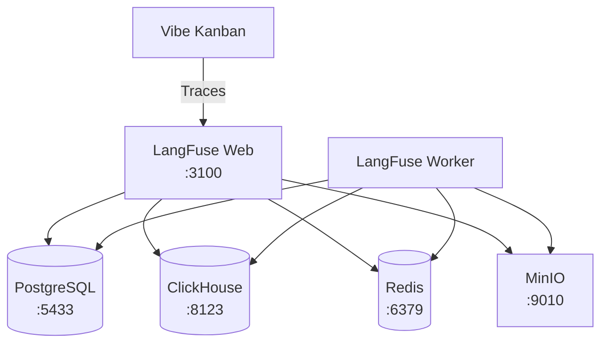

LangFuse provides powerful observability tools for tracing and debugging AI agent interactions. Running LangFuse locally gives you full access to traces, prompts, and metrics without needing a cloud account.

## Prerequisites

Before setting up LangFuse locally, ensure you have:

- **Docker Desktop** or **Docker Compose** installed and running
- **pnpm** package manager (v8 or later)
- Sufficient system resources (LangFuse runs multiple containers)

<Note>
LangFuse requires approximately 2GB of RAM when running all services. Ensure your system has adequate resources available.
</Note>

## Architecture Overview

The local LangFuse setup includes several interconnected services:



| Service | Port | Purpose |
|---------|------|---------|
| LangFuse Web | 3100 | Main UI and API |
| PostgreSQL | 5433 | Metadata storage |
| ClickHouse | 8123 | Analytics and traces |
| Redis | 6379 | Caching and queues |
| MinIO | 9010/9011 | S3-compatible object storage |

## Quick Start

<Steps>
<Step title="Start LangFuse services">
  From the repository root, run:

  ```bash
  pnpm run langfuse:up
  ```

  This starts all LangFuse services in detached mode. Initial startup may take 1-2 minutes as containers download and initialise.

  <Check>
  Verify services are running with `docker ps`. You should see containers for `langfuse-web`, `langfuse-worker`, `postgres`, `clickhouse`, `redis`, and `minio`.
  </Check>
</Step>

<Step title="Configure Vibe Kanban">
  Open the Vibe Kanban settings page and navigate to the **Observability** section. Enable LangFuse and enter the following configuration:

  | Field | Value |
  |-------|-------|
  | **Enable LangFuse** | ✓ (checked) |
  | **Host** | `http://localhost:3100` |
  | **Public Key** | `pk-lf-local-dev` |
  | **Secret Key** | `sk-lf-local-dev` |

  <Warning>
  These credentials are for local development only. Never use them in production environments.
  </Warning>
</Step>

<Step title="Access the LangFuse dashboard">
  Open [http://localhost:3100](http://localhost:3100) in your browser and log in with the pre-configured development credentials:

  | Field | Value |
  |-------|-------|
  | **Email** | `dev@local.test` |
  | **Password** | `password` |

  <Check>
  You should see the LangFuse dashboard with a pre-configured "Local Dev" project.
  </Check>
</Step>

<Step title="Start using Vibe Kanban">
  Run your Vibe Kanban development server. Agent traces will now appear in the LangFuse dashboard under the "Local Dev" project.
</Step>
</Steps>

## Managing LangFuse Services

### View logs

Monitor LangFuse service logs in real-time:

```bash
pnpm run langfuse:logs
```

Press `Ctrl+C` to stop following logs.

### Stop services

Stop all LangFuse services whilst preserving data:

```bash
pnpm run langfuse:down
```

### Reset data

To completely reset LangFuse and remove all stored data:

```bash
docker compose -f docker-compose.langfuse.yml down -v
```

<Warning>
This command removes all volumes, permanently deleting traces, projects, and user data.
</Warning>

## Troubleshooting

<AccordionGroup>
<Accordion title="Port conflicts">
  LangFuse uses several ports that may conflict with other services:

  | Port | Service | Common conflicts |
  |------|---------|------------------|
  | 3100 | LangFuse Web | Other web servers |
  | 5433 | PostgreSQL | Local PostgreSQL |
  | 6379 | Redis | Local Redis |
  | 8123 | ClickHouse | Other analytics tools |
  | 9010 | MinIO API | S3-compatible services |

  **Resolution**: Stop conflicting services before starting LangFuse, or modify the port mappings in `docker-compose.langfuse.yml`.
</Accordion>

<Accordion title="Services fail to start">
  If services fail to start or become unhealthy:

  1. Check Docker has sufficient resources allocated (at least 2GB RAM)
  2. Verify no port conflicts exist
  3. Review container logs:
     ```bash
     docker compose -f docker-compose.langfuse.yml logs [service-name]
     ```
  4. Try removing volumes and restarting:
     ```bash
     docker compose -f docker-compose.langfuse.yml down -v
     pnpm run langfuse:up
     ```
</Accordion>

<Accordion title="Traces not appearing">
  If traces don't appear in the LangFuse dashboard:

  1. **Verify configuration**: Ensure all settings are entered correctly in Vibe Kanban
  2. **Check connectivity**: Confirm `http://localhost:3100` is accessible
  3. **Verify credentials**: Ensure you're using the exact keys `pk-lf-local-dev` and `sk-lf-local-dev`
  4. **Check worker logs**: The worker processes traces asynchronously:
     ```bash
     docker logs langfuse-langfuse-worker-1
     ```
  5. **Wait for processing**: New traces may take a few seconds to appear in the dashboard
</Accordion>

<Accordion title="Docker daemon not running">
  If you see "Cannot connect to the Docker daemon":

  1. **macOS/Windows**: Start Docker Desktop from your applications
  2. **Linux**: Start the Docker service:
     ```bash
     sudo systemctl start docker
     ```
  3. Verify Docker is running:
     ```bash
     docker info
     ```
</Accordion>

<Accordion title="MinIO console access">
  For debugging object storage issues, access the MinIO console at [http://localhost:9011](http://localhost:9011) with credentials:

  | Field | Value |
  |-------|-------|
  | **Username** | `minioadmin` |
  | **Password** | `minioadmin` |
</Accordion>
</AccordionGroup>

## Configuration Reference

The local LangFuse setup uses pre-configured values for seamless development:

| Configuration | Value | Purpose |
|---------------|-------|---------|
| Organisation ID | `local-dev-org` | Pre-created organisation |
| Project ID | `local-dev-project` | Pre-created project |
| Project Name | `Local Dev` | Display name in dashboard |
| Public Key | `pk-lf-local-dev` | API authentication |
| Secret Key | `sk-lf-local-dev` | API authentication |
| User Email | `dev@local.test` | Dashboard login |
| User Password | `password` | Dashboard login |

<Tip>
All configuration values are defined in `docker-compose.langfuse.yml` and can be customised for your needs.
</Tip>
